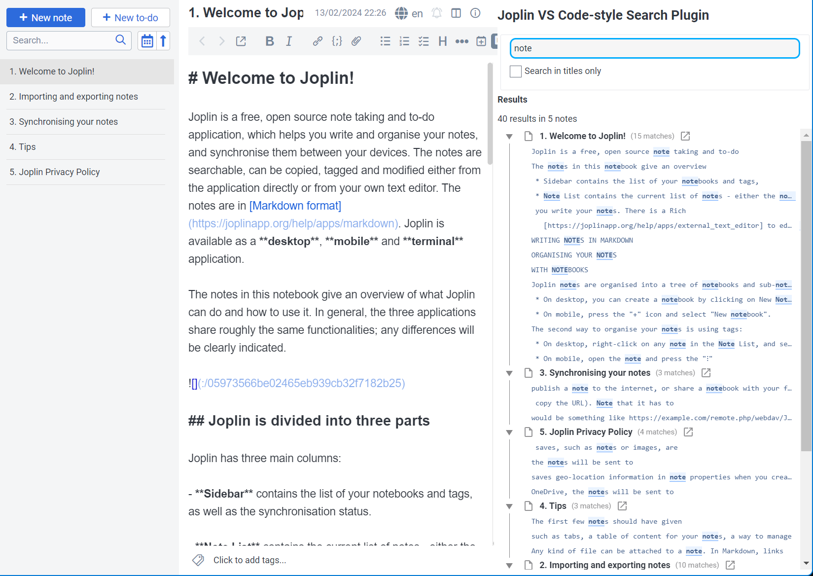

# VS-Code Style Search Plugin for Joplin

This Joplin plugin provides a note search panel that is patterned after the search panel in VS Code. Search for text, and matches will be shown grouped by file, one line per match, with the match text highlighted. Both plain text and regular expression syntax should work.

You can search for text just in note titles with the "Search in titles only" checkbox. (This only returns exact title prefix matches by default - you may need to use regular expression syntax like `note*` to search for partial title matches.)

Toggle the panel with `CTRL-SHIFT-F`.

## Status

This is a brand-new plugin, and there's a lot of possible search options that could be added. Some ideas:

- Scroll to a specific match line when clicked
- Toggle case sensitivity
- Limit searches to specific note folders, or ignore folders
- Pagination
- Switching to a view that shows each match with multiple lines of context above and below (similar to VS Code's "Show in Editor" popout panel)

I may not hae much time to work on new features myself, but happy to accept PRs!
